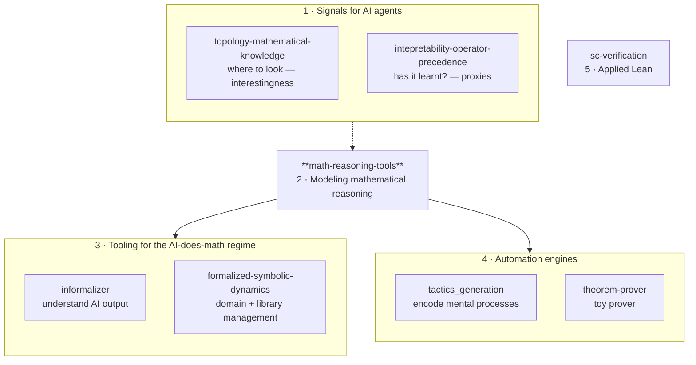

Mathematician (multidimensional symbolic dynamics) working on AI and formal methods for mathematics, with applications to blockchain and smart contracts.

I am currently operating a shift from mathematics to AI for mathematics which is a continuation of my initial interests in research. When I entered the École Normale Supérieure (ENS Ulm), I was obsessed — more than with mathematics itself — with how the mind works when doing mathematics, and more generally with how to mechanically interpret how the mind works, and how low-level mechanisms relate to high-level introspective interpretations. I explored this through adjacent, more general problems: the hard problem of consciousness, the mind–body problem. Artificial intelligence is a natural field in which to push these questions further. I chose my field of mathematics not because it is central to mathematics, but because in multidimensional dynamical systems there is a natural bridge between judgement structures inherently related to the mind and low-level causal structures deriving from the rules defining the system. This is also a natural angle from which to explore how AI learns to deal with causality. So AI for mathematics is, for me, a way to get back to mainstream research while also following my initial scientific interest.

You can find a list of my publications [here](https://scholar.google.com/citations?user=in4PMm0AAAAJ&hl=fr). Philosophical essays are available [there](https://philarchive.org/s/Silvere%20Gangloff).

The work below mainly concerns AI for mathematics and formal methods. It is organized around a working assumption — that AI is doing, or will soon do, a large part of mathematics — and around the questions that follow from it:

1. **Signals for AI agents** — where should an autonomous agent look (interestingness), and how do we tell whether it has actually learnt something?
2. **Modeling mathematical reasoning** — treating mathematical practice as a complex state machine, refining the model and at the same time testing tools derived from it.
3. **Tooling for the AI-does-math regime** — making sense of what AI produces, encoding mathematicians' mental processes into Lean, and managing formalized libraries at the domain level.
4. **Automation engines** — systems that generate proofs or tactics directly: theorem provers and tactic-generation pipelines.
5. **Applied Lean** — applications of Lean and formal verification beyond mathematics, currently to smart contracts.

---

## 1 · Signals for AI agents — where to look, and has it learnt?

Two complementary kinds of signal for autonomous AI mathematical research: *where to look* (interestingness) and *whether something has actually been learnt*.

- **[topology-mathematical-knowledge](https://github.com/Sfgangloff/topology-mathematical-knowledge)** — Experiments on the structure of formal mathematics, with a focus on automatically detecting bridges and potential bridges between domains. Bridges are particularly valued in mathematics because they are hard to find. The position of this work in AI for math is to design *interestingness signals* — telling AI agents where to look — under the assumption that they autonomously search for mathematical problems to tackle. Concretely: Leiden community detection recovers named mathlib modules without supervision, and a bridge-theorem detector recovers 6 / 8 historically-known cross-domain connections. Targeting AI for Math at ICML 2026.
- **[intepretability-operator-precedence](https://github.com/Sfgangloff/intepretability-operator-precedence)** — Falls into the same category, but on the other axis: how do we detect whether a model has actually learnt a rule, using mechanistic interpretability? This helps define proxies, and thus signals, for AI agents that they have actually learnt something — pretty much like for humans (how do we know we have learnt a rule?). Concretely: activation patching and direct logit attribution on operator precedence (BODMAS) in Qwen2.5-Math-7B localize the computation to MLP L22 (computation hub) and head L27H11 (`*` → `=` routing), with the `+` token largely context-independent.

## 2 · Modeling mathematical reasoning

- **[math-reasoning-tools](https://github.com/Sfgangloff/math-reasoning-tools)** — Based on the idea of modeling mathematical reasoning, with the working hypothesis that it behaves like a complex state machine. The repository simultaneously refines that model and tests tools derived from the modelisation — including tools interacting with the Lean theorem prover, but also tools mimicking other aspects of mathematical practice that are not purely formal.

  Concretely, the tools are exposed as MCP servers to Claude Code: `math-compute` (SymPy / Z3), `math-viz` (plots, diagrams), `math-search` (arXiv / OEIS / MathWorld / Loogle / zbMATH), `commutative-diagrams` (TikZ / Quiver), `proof-explorer` (Lean-aware introspection of proof state). Lean-specific tooling lives upstream in [`oOo0oOo/lean-lsp-mcp`](https://github.com/oOo0oOo/lean-lsp-mcp) — the canonical Lean MCP, to which I contribute. `math-reasoning-tools` also indexes other MCP servers for mathematics, so the broader ecosystem is discoverable from a single entry point.

## 3 · Tooling for a world in which mathematical proofs are mostly written by AI

Once a large part of mathematics is being produced by AI, several supporting needs follow: making sense of what was produced, encoding mathematicians' mental processes into Lean so that more of practice is reachable formally, and managing the resulting formalized libraries at the domain level.

- **[informalizer](https://github.com/Sfgangloff/informalizer)** — A tool which assumes that a large part of mathematics is done by AI. Once that is the case, how do we make sense of what the AI has done, how do we understand it? This tool serves that purpose: Lean 4 file → Markdown report. Builds a dependency DAG, categorizes declarations (Central Result, Key Lemma, …), and uses the Anthropic API to generate per-declaration explanations and per-file summaries. Tracks per-declaration understanding state (`unknown` / `learning` / `known`).
- **[formalized-symbolic-dynamics](https://github.com/Sfgangloff/formalized-symbolic-dynamics)** — Two purposes. First, formalizing articles in my field — multidimensional symbolic dynamics — currently centered on Hochman & Meyerovitch's entropy characterization of multidimensional SFTs. Second, a test case for *domain-level library management*, again under the assumption that AI is doing a lot of the mathematics-proving: automatic uniformization of definitions, reduction to minimal definition sets, standardization, and decomposition into chunks easily integrable into standardized libraries (mathlib).

## 4 · Automation engines

Systems that produce proofs or tactics directly, as opposed to the tooling that wraps around it.

- **[tactics_generation](https://github.com/Sfgangloff/tactics_generation)** — Experiments with tactics generation, also as a way to encode in Lean the mental processes of mathematicians that admit formalization. 2×2 factorial study on LLM tactic generation in Lean: planning vs no planning × live LSP feedback vs none. Finding: live compiler access dominates planning alone; the combined condition is strongest.
- **[theorem-prover](https://github.com/Sfgangloff/theorem-prover)** — A toy experiment to see what modern theorem provers look like. RL pipeline (instrument mathlib → record steps → train → prove); built as a learning project rather than a research deliverable.

## 5 · Applied Lean

- **[sc-verification](https://github.com/Sfgangloff/sc-verification)** — Reflects my interest in applications of Lean (and formal verification more broadly: Certora CVL specifications, Hoare-logic style writeups) to Solidity smart contracts. I worked for some time in crypto and find this a particularly interesting application area.

---

## How the repos relate

## Repo index

| Repo | Role | Lang | One-liner | Status |
|---|---|---|---|---|
| [topology-mathematical-knowledge](https://github.com/Sfgangloff/topology-mathematical-knowledge) | 1 Signals — where to look | Python | Bridge detection on the mathlib dependency graph; interestingness signals for autonomous search | Paper track — ICML 2026 AI4Math |
| [intepretability-operator-precedence](https://github.com/Sfgangloff/intepretability-operator-precedence) | 1 Signals — has it learnt? | Jupyter | Mech-interp proxies for whether a model has learnt a rule (BODMAS in Qwen2.5-Math-7B) | Study complete |
| [math-reasoning-tools](https://github.com/Sfgangloff/math-reasoning-tools) | 2 Modeling reasoning | Python | State-machine model of mathematical reasoning + MCP servers (compute, viz, search, diagrams, proof-explorer) | Active |
| [informalizer](https://github.com/Sfgangloff/informalizer) | 3 Tooling — understand AI output | Python | Lean files → role-categorized Markdown reports via Claude API | Active |
| [formalized-symbolic-dynamics](https://github.com/Sfgangloff/formalized-symbolic-dynamics) | 3 Tooling — domain + library mgmt | Lean 4 | Symbolic-dynamics articles formalized; domain-level library management workbench | Active, long-running |
| [tactics_generation](https://github.com/Sfgangloff/tactics_generation) | 4 Automation engines — encode mental processes | Lean / Python | 2×2 study + encoding mathematicians' moves in Lean | Study complete |
| [theorem-prover](https://github.com/Sfgangloff/theorem-prover) | 4 Automation engines — toy prover | Python / Lean | Toy RL pipeline to see what modern theorem provers look like | Learning project |
| [sc-verification](https://github.com/Sfgangloff/sc-verification) | 5 Applied Lean | Solidity | Formal verification of smart contracts | Experimental |

## External contributions

- [`oOo0oOo/lean-lsp-mcp`](https://github.com/oOo0oOo/lean-lsp-mcp) — upstream contributions for Lean-related MCP tooling (the canonical Lean MCP). My own [`math-reasoning-tools`](https://github.com/Sfgangloff/math-reasoning-tools) is positioned to be complementary, focused on non-Lean tools.
- [`google-deepmind/formal-conjectures`](https://github.com/google-deepmind/formal-conjectures) — formalizing conjectures in Lean 4.
- [`leanprover-community/mathlib4`](https://github.com/leanprover-community/mathlib4) — contributing basic library content for symbolic dynamics.

