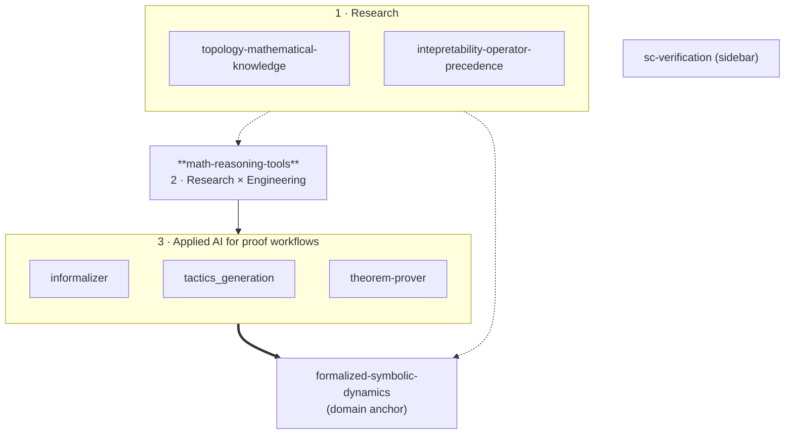

Mathematician (multidimensional symbolic dynamics) working on AI and formal methods for mathematics and applications to blockchain and smart contracts.

My work organizes into three layers, plus a domain anchor:

1. **Research** — empirical studies of how mathematical knowledge is organized and how language models reason about it.
2. **Research × Engineering** — [`math-reasoning-tools`](https://github.com/Sfgangloff/math-reasoning-tools) sits at this boundary, simultaneously developing a model of mathematical reasoning and a concrete MCP-server implementation for Claude Code.
3. **Applied AI for proof workflows** — tooling and empirical studies aimed at making proof assistants more productive.

The domain anchor is ongoing Lean 4 formalization of symbolic dynamics, which provides the target domain and ground truth for the AI work.

---

## 1 · Research — empirical studies of mathematical structure

How is mathematical knowledge organized, and how do language models actually compute over it?

- **[topology-mathematical-knowledge](https://github.com/Sfgangloff/topology-mathematical-knowledge)** — Unsupervised analysis of the mathlib theorem-dependency graph. Leiden community detection recovers named Mathlib modules without supervision; a bridge-theorem detector recovers 6 / 8 historically-known cross-domain connections. Targeting AI for Math at ICML 2026.
- **[intepretability-operator-precedence](https://github.com/Sfgangloff/intepretability-operator-precedence)** — Mechanistic interpretability of operator precedence (BODMAS) in Qwen2.5-Math-7B. Activation patching and direct logit attribution localize the computation to MLP L22 (computation hub) and head L27H11 (`*` → `=` routing), with the `+` token largely context-independent.

## 2 · Research × Engineering — math-reasoning-tools

- **[math-reasoning-tools](https://github.com/Sfgangloff/math-reasoning-tools)** — A bridge between research and engineering. It develops in parallel:
  - a **model of mathematical reasoning** — which cognitive moves a working mathematician performs, and which of them lift cleanly into callable tools;
  - a **concrete implementation** — MCP servers that expose those moves to Claude Code.

  Scope is deliberately **non-Lean tooling**: `math-compute` (SymPy / Z3), `math-viz` (plots, diagrams), `math-search` (arXiv / OEIS / MathWorld / Loogle / zbMATH), `commutative-diagrams` (TikZ / Quiver), `proof-explorer` (Lean-aware introspection of proof state).

  Lean-specific tooling lives upstream in [`oOo0oOo/lean-lsp-mcp`](https://github.com/oOo0oOo/lean-lsp-mcp) — the canonical Lean MCP, to which I contribute. `math-reasoning-tools` also indexes other MCP servers for mathematics, so the broader ecosystem is discoverable from a single entry point.

## 3 · Applied AI for proof workflows

- **[informalizer](https://github.com/Sfgangloff/informalizer)** — Lean 4 file → Markdown report. Builds a dependency DAG, categorizes declarations (Central Result, Key Lemma, …), and uses the Anthropic API to generate per-declaration explanations and per-file summaries. Tracks per-declaration understanding state (`unknown` / `learning` / `known`).
- **[tactics_generation](https://github.com/Sfgangloff/tactics_generation)** — 2×2 factorial study on LLM tactic generation in Lean: planning vs no planning × live LSP feedback vs none. Finding: live compiler access dominates planning alone; the combined condition is strongest.
- **[theorem-prover](https://github.com/Sfgangloff/theorem-prover)** — Toy RL pipeline (instrument mathlib → record steps → train → prove); built as a learning project for Lean × AI rather than a research deliverable.

## Domain anchor · Symbolic dynamics & whole-library Lean management

- **[formalized-symbolic-dynamics](https://github.com/Sfgangloff/formalized-symbolic-dynamics)** — Lean 4 formalization of articles in symbolic dynamics (currently centered on Hochman & Meyerovitch's entropy characterization of multidimensional SFTs); also a workbench for whole-library Lean management — definition-set reduction, convention standardization, and PR-sized decomposition for upstreaming into mathlib.

## Applied formal methods

- **[sc-verification](https://github.com/Sfgangloff/sc-verification)** — Experiments applying formal verification (Certora CVL specifications, Hoare-logic style writeups) to Solidity smart contracts.

---

## How the repos relate

## Repo index

| Repo | Layer | Lang | One-liner | Status |
|---|---|---|---|---|
| [topology-mathematical-knowledge](https://github.com/Sfgangloff/topology-mathematical-knowledge) | 1 Research | Python | Leiden clustering + bridge detection on the mathlib dependency graph | Paper track — ICML 2026 AI4Math |
| [intepretability-operator-precedence](https://github.com/Sfgangloff/intepretability-operator-precedence) | 1 Research | Jupyter | Mech-interp of BODMAS in Qwen2.5-Math-7B | Study complete |
| [math-reasoning-tools](https://github.com/Sfgangloff/math-reasoning-tools) | 2 Research × Engineering | Python | Non-Lean MCP servers (compute, viz, search, diagrams, proof-explorer) for Claude Code; index of other math MCPs | Active |
| [informalizer](https://github.com/Sfgangloff/informalizer) | 3 Applied | Python | Lean files → role-categorized Markdown reports via Claude API | Active |
| [tactics_generation](https://github.com/Sfgangloff/tactics_generation) | 3 Applied | Lean / Python | 2×2 study: planning × LSP feedback for LLM tactic generation | Study complete |
| [theorem-prover](https://github.com/Sfgangloff/theorem-prover) | 3 Applied | Python / Lean | Toy RL pipeline for Lean theorem proving | Learning project |
| [formalized-symbolic-dynamics](https://github.com/Sfgangloff/formalized-symbolic-dynamics) | Domain | Lean 4 | Symbolic-dynamics articles formalized in Lean; whole-library management workbench | Active, long-running |
| [sc-verification](https://github.com/Sfgangloff/sc-verification) | Sidebar | Solidity | Formal verification experiments on smart contracts | Experimental |

## External contributions

- [`oOo0oOo/lean-lsp-mcp`](https://github.com/oOo0oOo/lean-lsp-mcp) — upstream contributions for Lean-related MCP tooling (the canonical Lean MCP). My own [`math-reasoning-tools`](https://github.com/Sfgangloff/math-reasoning-tools) is positioned to be complementary, focused on non-Lean tools.

